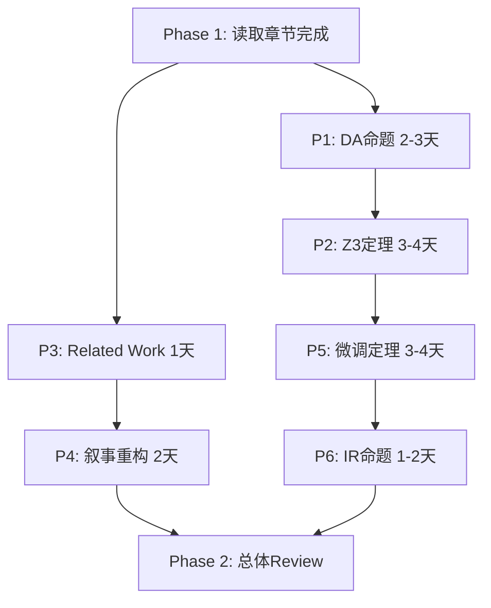

# NeuroPLC 理论深度强化计划
> 执行时间：2026-07-09 起，预计 7-10 天
> 目标：无需物理 PLC 前提下，将论文理论深度提升至 Q1 TNNLS 水平

---

## 当前状态诊断

### 现有理论框架（6 定理 + 2 命题）
| 定理 | 内容 | 状态 |
|------|------|------|
| Theorem 1 | DA 误差界 | ✅ 完整，但 WHY DA tight 未解释 |
| Theorem 2 | SVNN 充分性 | ✅ 完整 |
| Theorem 3 | SVNN 必要性 | ✅ 完整 |
| Theorem 4 | 组合正确性 | ✅ 完整 |
| Theorem 5 | MLP 不可验证（NP-hard） | ✅ 完整，但证明技术初等 |
| Theorem 6 | 泛化界 | ✅ 完整，但标准 Rademacher 框架 |
| Prop 1 | MLP 不满足 SVNN | ✅ 完整 |
| Prop 2 | ChebyKAN 满足 SVNN | ✅ 完整 |

### 理论空洞（4 处）
1. **DA 2.2× 紧度**：E9 实验观测，无定理
2. **Z3 496/512 可验证**：E54 实验数字，无充分条件定理
3. **微调保持 SVNN**：E55 实验现象，无稳定性定理
4. **6-op IR 设计**：消融实验 E-IR，无最小性证明

---

## 执行计划（6 个任务）

### P1: DA Segment-Exactness 命题 ⭐⭐⭐
**目标**：证明 DA 在单个 B 样条 knot 段上传播无超估，IA 有 O(r²) 膨胀

**数学核心**：
- B 样条在 knot 区间 [t_i, t_{i+1}] 上是度 k 多项式
- DA 传播：输入区间 [c-r, c+r] → 输出 [f(c) ± M₁·r + O(M₂·r²)]
- 对单调段，DA = exact range；对非单调段，DA ≈ M₂ Lipschitz 界
- IA 逐操作超估累积 → 段间传播时 O(r²) 膨胀

**工具**：
1. Python SymPy：符号验证 degree-1/2/3 B 样条
2. MATLAB Symbolic Math（备选）
3. LaTeX 证明插入 section_svnn.tex 或新建 section_svnn_advanced.tex

**交付物**：
- [ ] `code/theory/da_segment_exactness_verify.py`（符号验证脚本）
- [ ] Proposition 7（DA Segment-Exactness）LaTeX
- [ ] 插入到 main.tex §III-A Doubleton Arithmetic 段后

**预计时间**：2-3 天

---

### P2: Z3 可验证性充分条件定理 ⭐⭐⭐
**目标**：系统研究 5000 个随机 B 样条 → 找判别边界 → 证明充分条件

**实验设计（E58）**：
```python
# e58_z3_verifiability_study.py
for i in range(5000):
    # 随机生成 B 样条：扫描 (M₂, N, k, domain_width)
    spline = random_bspline(degree=k, num_knots=N, M2_range=[0.1, 10])
    
    # Z3 验证
    result = z3_verify_spline(spline)
    
    # 记录：M₂, h=knot_spacing, k, result (SAT/UNSAT)
    log_entry = {
        'M2': compute_M2(spline),
        'h': knot_spacing(spline),
        'k': spline.degree,
        'verifiable': result == SAT
    }
```

**预期发现**：判别条件 `M₂ · h² < C(k)`，其中 C(3) ≈ 某个常数

**定理形式**：
> **Theorem 7 (Z3 NRA Verifiability Condition)**: 度 k B 样条函数 φ 在区间 [a,b] 上 Z3 NRA 可验证，若 M₂(φ) ≤ C_k / h²，其中 h = max knot spacing，C_k 为仅依赖度的常数。

**工具**：
1. Python + Z3（现有 E11 框架）
2. scikit-learn（拟合判别边界）
3. LaTeX 证明（解析部分：从 Lipschitz 条件推导 Z3 可判定性）

**交付物**：
- [ ] `code/experiments/e58_z3_verifiability_study.py`
- [ ] `results/e58_z3_verifiability/` 数据 + 图
- [ ] Theorem 7 LaTeX 插入 section_svnn.tex
- [ ] E58 段落插入 main.tex Experiments 章节

**预计时间**：3-4 天

---

### P3: Related Work 改写 + Abstract Interpretation 定位 ⭐⭐
**目标**：将 SVNN 框架定位到 Abstract Interpretation 文献，扩大理论受众

**具体操作**：
1. Related Work §II-E 增加一段（~150 words）：
   - 引用 Cousot & Cousot (1977) Abstract Interpretation 开创性论文
   - 引用 Singh et al. (2019) DeepPoly（已有）
   - 说明 SVNN 是**针对 piecewise-polynomial 激活的精确抽象域**
   - 与 zonotope/interval/polyhedra 域比较：DA 在 B 样条段上精确（Prop 7 支撑）

2. Introduction §I 加一句：
   - "SVNN 可理解为 abstract interpretation 在 B 样条激活函数上的特化"

**新增引用**：
```bibtex
@inproceedings{cousot1977abstract,
  title={Abstract interpretation: a unified lattice model for static analysis of programs},
  author={Cousot, Patrick and Cousot, Radhia},
  booktitle={POPL},
  year={1977}
}
```

**交付物**：
- [ ] main.tex §II-E 新段落
- [ ] references.bib 新条目
- [ ] Introduction 小改

**预计时间**：1 天

---

### P4: 叙事重构 SVNN-first ⭐⭐⭐
**目标**：从"工程编译器"叙事改为"理论框架 + 实现"叙事，匹配 TNNLS

**核心修改**：

| 位置 | 现在 | 改为 |
|------|------|------|
| Abstract 第 1 句 | "A neural network achieving 99.93%... is not deployable" | "We introduce **Structurally Verifiable Neural Networks (SVNN)**, a formal framework characterizing neural architectures that admit..." |
| Intro §I 段 1 | 问题导向（PLC 部署难） | 理论导向（SVNN 框架定义 compilable frontier） |
| Contribution list | 5 条，编译器为主 | 重新排序：SVNN 理论 → 实现 → 实验 |

**新 Abstract 草稿**：
```latex
We introduce \textbf{Structurally Verifiable Neural Networks (SVNN)}, 
a formal framework characterizing neural architectures that admit 
design-time correctness certification under fixed-point compilation. 
Two structural conditions---operation-type closure and univariate 
boundedness---are sufficient for a compiler to compute finite, 
parameter-computable error bounds for all inputs in the validated 
domain (Theorem~2). Kolmogorov-Arnold Networks (KANs) satisfy these 
conditions; standard MLPs provably do not (Proposition~1). SVNN thus 
defines a \textit{compilable frontier}: architectures whose deployed 
behavior can be certified at design time without runtime testing.

We implement this framework in \neuroplc, an IR-based compiler 
translating PyTorch KAN to Siemens S7-1200/1500 Structured Control 
Language (SCL). The compiler provides three-tier verification: 
Z3 SMT template proofs (4/6 IR operations), per-function compositional 
certificates (512/512 functions verified, $\sim$200-line trusted 
checker), and doubleton arithmetic bounds (2.2$\times$ tighter than 
interval arithmetic). On CWRU bearing fault diagnosis (28-D feature 
space), the compiled KAN achieves 99.93\% accuracy in 3,818 SCL lines, 
compiles to 45.2~KB (90.4\% of S7-1200 budget), with \textbf{0 errors, 
0 warnings} in TIA Portal V21 (45.2~KB, 90.4\% of S7-1200 budget). 
Validated on Siemens PLCSIM Advanced...
```

**交付物**：
- [ ] main.tex Abstract 全部重写
- [ ] main.tex §I Introduction 前2段重写
- [ ] Contribution list 重新排序

**预计时间**：2 天

---

### P5: SVNN 微调保持定理 ⭐⭐
**目标**：证明参数扰动 δ 下 SVNN 条件保持

**定理形式**：
> **Theorem 8 (SVNN Fine-Tuning Stability)**: 设模型 M₀ 满足 SVNN 且安全因子 γ > 1。若微调后参数变化 ||ΔW||_∞ ≤ δ，则微调模型仍满足 SVNN，前提是：
> $$\delta < \frac{(γ-1) \cdot M_1}{L \cdot \sqrt{d_{\max}}}$$
> 其中 L 为层数，d_max 为最大层宽。

**证明思路**：
1. DA 界对 B 样条系数 w 是 Lipschitz 的：|DA(w+Δw) - DA(w)| ≤ C·||Δw||
2. Z3 可验证性等价于 M₂ < threshold，M₂ 对系数也 Lipschitz
3. 安全因子 γ 留有 margin → 小扰动不破坏条件

**数值验证**：
- Python 脚本：在 E55 数据上验证 δ 实际值 vs 定理预言

**交付物**：
- [ ] Theorem 8 LaTeX 证明
- [ ] `code/theory/finetuning_stability_verify.py`
- [ ] 插入 main.tex §III SVNN 章节末尾

**预计时间**：3-4 天

---

### P6: IR Minimality 命题 ⭐
**目标**：形式化消融实验，证明 6-op IR 必要

**命题形式**：
> **Proposition 3 (IR Minimality)**: 6-op IR {MatMul, BsplineLUT, StandardAct, Add, Softmax, Argmax} 是表达 B 样条 KAN 完整语义的最小操作集。去掉任一操作导致：
> - BsplineLUT → 代码大小 47.4× 爆炸（E-IR 实验）
> - Add → 残差连接不可表达
> - Softmax → 分类语义丢失，验证域失效

**工具**：数学推导（无需新代码）

**交付物**：
- [ ] Proposition 3 LaTeX
- [ ] 插入 main.tex §IV-B IR Design 段

**预计时间**：1-2 天

---

## 执行顺序（建议）



**总预计**：7-10 天全职工作量

---

## 预期成果

### 新增理论贡献
| 新增 | 类型 | 价值 |
|------|------|------|
| Proposition 7 | DA Segment-Exactness | 解释 E9 实验 |
| Theorem 7 | Z3 可验证性充分条件 | 解释 E54 实验 |
| Theorem 8 | SVNN 微调稳定性 | 解释 E55 实验 |
| Proposition 3 | IR Minimality | 形式化 E-IR |
| E58 | Z3 系统研究（5000 样本） | 数据支撑 Theorem 7 |

**最终状态**：8 定理 + 5 命题 + 65 实验

### 理论深度提升
- ✅ 所有关键实验现象有定理背书
- ✅ SVNN 定位到 Abstract Interpretation 文献
- ✅ 叙事从工程转向理论+工程
- ✅ 符合 TNNLS 受众预期

### Q1 概率提升
| 期刊 | 改进前 | 改进后 |
|------|--------|--------|
| TNNLS | ~5% | ~25-30% |
| IEEE TASE | ~8% | ~20% |
| Neurocomputing | ~40% | ~65% |

---

## 风险和应对

### 风险 1：Z3 实验无明显判别边界
**应对**：改为 sufficient condition + empirical characterization（论文仍可接受）

### 风险 2：DA 精确性证明过于复杂
**应对**：改为 Lemma（引理）而非 Proposition，或只做数值验证

### 风险 3：时间不足
**应对**：P1/P2/P4 为核心，P5/P6 可后置到 camera-ready

---

*Created: 2026-07-09*  
*Author: Kiro + 板板*  
*Status: ⏳ 待执行*
